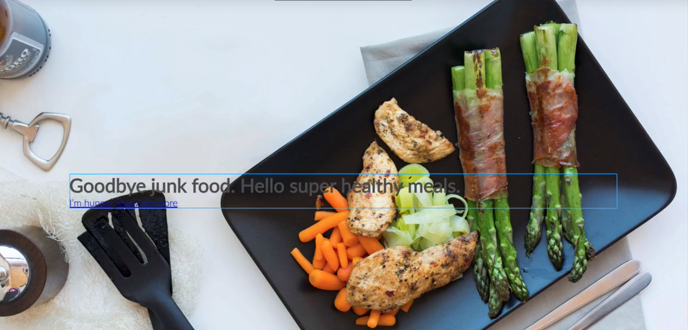
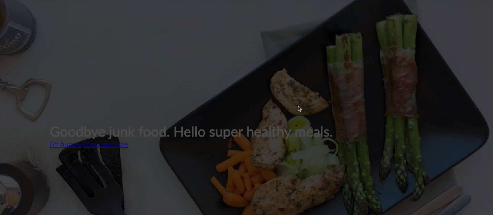

### Working with Text on images

Now lets see how to place text on images properly

```
 <header>
	
	<div class="hero-text-box">
       
       <h1>Goodbye junk food. Hello super healthy meals.</h1>
       <a href="#">I'm hungry</a> 
       <a href="#">Show me more</a>
	</div>

</header>
```

Always give width for the textbox. 
Then if you want to move the textbox DIV give ```position:absolute``` along with ```top:0``` or ```left:0``` or ```right:0``` or ```bottom:0```

It is also a good practise to give ```transform: translate(-50%, -50%)``` along with ```position:absolute``` and ```top/left/right/bottom```. ```transform:translate``` has better performance than using ```top/left/right/bottom```

```
.hero-text-box {
   position: absolute;
   width: 1140px;
   top:50%;
   left:50%;
   transform: translate(-50%, -50%);
}

```

Now the text would be nicely centered and it will look like this.



### Setting Contrast 

Now if you see the above image text on the image does not look good. As mentioned in the earlier chapter to make text look good on images one way is to put a black transparent background on the image and put a white color text on it.

 #### Adding gradient:

Now we have already learned from the earlier chapter image on text will look good only if the image is transparent or out-of-focus etc and text should be white. So now lets add a transparent overlay on top of the image like this.

```
header{
	background-image: linear-gradient(rgba(0,0,0,0.7), rgba(0,0,0,0.7)), url(hero.jpg);
	background-size:cover;
	background-position: center;
	height: 100vh; //means 100% of the view port
}
```

Now this will look like this



  #### Making changes to the font
  
   ```
      h1{
          color: #fff;
	  font-size: 200%  // Refer what are good font sizes for heading in the earlier chapters.
      }
   
   ```

   #### So how 200%?
   
    In responsive design eveything should be mentioned in percentages and only in the global scope we should mention pixels. So the global scope is the below code
    
    ```
     html {
 	background-color: #fff;
 	color: #555;
	font-family: 'Lato', 'Arial', sans-serif;
	font-weight: 300;
	font-size: 20px;
	text-rendering: optimizeLegibility;  //using this is a good practise
     }
    
    ```
    
    So when you say font-size:200% it refers to 200% of font-size:20px
    
  #### Decrease the font weight
  
Now remember as in the earlier chapters when the font-size is big decrease the font-weight. Usually ```<h1>``` tag comes with bold formatting.
   
```
      h1{
          color: #fff;
	  font-size: 200%  // Refer what are good font sizes for heading in the earlier chapters.
	  font-weight: 300;
      }
   
```
   
   Other things that you can do to make ```<h1>``` look better
   
```
      h1{
          color: #fff;
	  font-size: 200%  // Refer what are good font sizes for heading in the earlier chapters.
	  font-weight: 300;
	  text-transform: uppercase;
	  letter-spacing: 1px;  // so the letters don't look very compressed
	  word-spacing: 3px; //letters between words
      }
   
``` 
