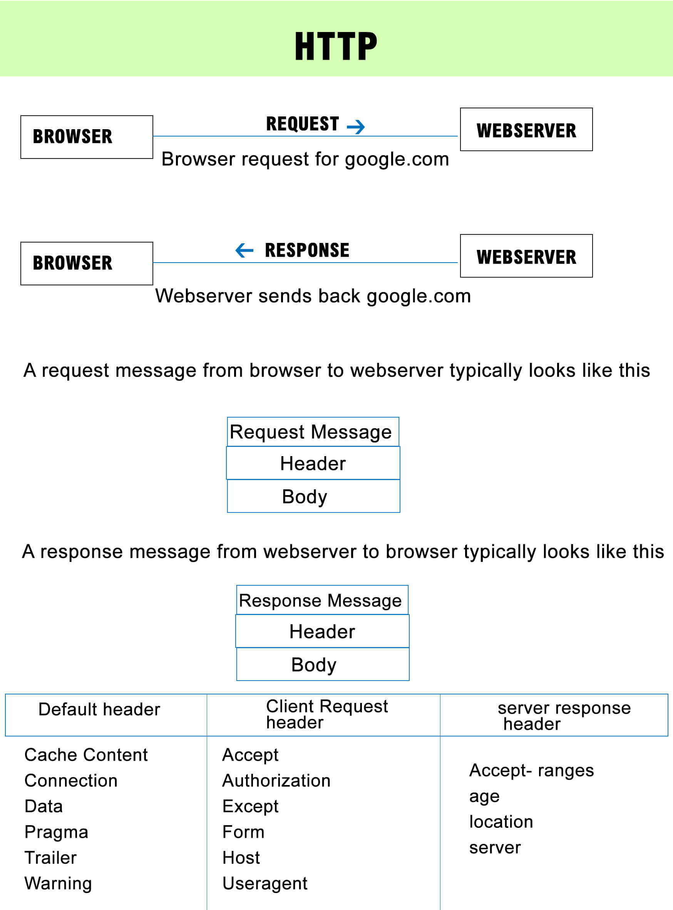

# Building a RESTful API in NODEjs

## :beginner: STEP 1: Starting a http server

```Javascript

/* ----http server allows you to listen on ports and respond with data--- */

// Dependencies

var http = require('http');

/* ---- The server should respond to all request with a string --- */

var server = http.createServer(function(req,res){
	res.end('Hello World\n');
})

/* ----start the server, and have it listen on port 3000 ---- */

server.listen(3000,function(){
	console.log("The server is listening on port 3000");
})

```

/* ---- To run the program on command line ----*/

```Javascript
curl localhost:3000
```

---

## :beginner: STEP 2: Parsing Request Paths - Using the URL library

/* ---------- 

The below code gets what URL has the user requested for. If the user has requested for http://xyz.com/admin/planet.html, the below code will identify that the user has requested for planet.html ---------

----------- */


```Javascript

var http = require('http');
var url = require('url');


/* ---- The server should respond to all request with a string ----- */

var server = http.createServer(function(req,res){

/* -----when someone hit localhost:3000, the below function gets called and when each time this function gets called req and res is brand new every time. req object contains a whole bunch of information on what that user is asking for ------ */
	
/* ----- Get the URL and parse it ----*/

var parsedURL = url.parse(req.url, true); 
/* -------req.url will have the full URL what the user is asking for.
when you pass true it will call querystring.parse function which returns the query string 'foo=bar&abc=xyz&abc=123' returns as

{
   foo: 'bar',
   abc['xyz','123']
}  --------*/


/* -----Get the path from the URL -------*/

var path = parsedURL.pathname; /* ------- returns /admin/planet.html -> this is an untrimmed path ------ */

/* ----------To get the trimmed path -> this will trim unnecessary slashes(/) from the URL -------- */

var trimmedPath = path.replace(/^\/+|\/+$/g,'');

/* ------ Send the response ------- */
res.end('Hellow World\n');

/* -----Get print the path what the user has asked for ie. admin/planet.html -------*/
console.log('Request recieved on path: '+trimmedPath);

})

/* ---------- Start the server, and have it listen on port 3000 -------- */

server.listen(3000,function(){
	console.log("The server is listening on port 3000");
})

``` 

---

## :beginner: STEP 3: Parsing HTTP Methods: 

/* Now here what we will do is, when a request comes in we want to figure out which http method the user is requesting */

```Javascript

var http = require('http');
var url = require('url');

var server = http.createServer(function(req,res){
    var parsedURL = url.parse(req.url, true);
    var path = parsedURL.pathname; 
    var trimmedPath = path.replace(/^\/+|\/+$/g,'');

    // Get the HTTP method. Method is one of the objects available in the req object. 
    // Remember that req object is new for every single incoming request
    // toLowerCase() will convert GET to get, or POST to post

    var method = req.method.toLowerCase();
   
    res.end('Hellow World\n');
    console.log('Request recieved on path: '+trimmedPath + 'with method: ' + method);
})


server.listen(3000,function(){
    console.log("The server is listening on port 3000");
})

```

## To run the code

```
curl localhost:3000/foo/bar

```

returns

Request recieved on path: foo/bar with method: get

### HTTP Methods: 

/* The http methods are POST, GET, PUT and delete */

/* Get method is used to get/retrieve information from the server and display in the client browser. Get method will return the STATUS LINE, HEADER information and content

   Eg: http://xyz.com/?name={name}&age={age} -> You are trying to get {name} and {age} from the server

/* Post method is used to send data to the server from the client and also get data from the server */

## GET and POST Introduction Videos

[](http://www.youtube.com/watch?v=RkFswrkkie8)


[](http://www.youtube.com/watch?v=9o_4lsOkQ3g)    


/* If you want to remove any data in the server then you can use the delete method. The client will send delete request to the server and the resource will be deleted */

/* From the server if you want to get only STATUS LINE and HEADER information of the particular request then you can use the HEAD method */

/* If the client wants to establish a connection with the server then we can use the CONNECT method */

---

## :beginner: STEP 4: How to parse query string from a URL

```
var http = require('http');
var url = require('url');

var server = http.createServer(function(req,res){
    var parsedURL = url.parse(req.url, true);
    var path = parsedURL.pathname; 
    var trimmedPath = path.replace(/^\/+|\/+$/g,'');

    // the query string is stored in the variable queryStringObject
    var queryStringObject = parsedURL.query;

    var method = req.method.toLowerCase();
   
    res.end('Hellow World\n');
    console.log('Request recieved on path: '+trimmedPath + 'with method: ' + method 'and with these query string paramaters', queryStringObject);
})


server.listen(3000,function(){
    console.log("The server is listening on port 3000");
})

```

To run the code

> node index.js

> curl localhost:3000/foo?fiss=buzz

returns

Request recieved on path: foo/bar with method: get and with these query string parameters ```{fiss:'buzz'}```

---

## :beginner: STEP 5: Parsing the HTTP headers



So what are http headers? 

HTTP headers allow the client and the server to pass additional information with the request or the response. They are in the form of name and value pairs seperated by a single colon. HTTP headers are the code that transfers data between a Web server and a browser. HTTP headers are mainly intended for the communication between the server and client in both directions.


```Javascript

var http = require('http');
var url = require('url');

var server = http.createServer(function(req,res){
    var parsedURL = url.parse(req.url, true);
    var path = parsedURL.pathname; 
    var trimmedPath = path.replace(/^\/+|\/+$/g,'');
    
    var queryStringObject = parsedURL.query;

    var method = req.method.toLowerCase();

    // Get the HTTP headers which the user might have sent as an object

    var headers = req.headers;

   
    res.end('Hellow World\n');
    
    // Log the header
    console.log('Request recieved with these headers:', headers);
})


server.listen(3000,function(){
    console.log("The server is listening on port 3000");
})

```

> node index.js

So what is an header. Information can be injected to headers and the above code prints the header information. The result might look like this


### OUTPUT: 

```
{host: 'localhost:3000',
 connection: 'keep-alive',
 foo: 'bar',
 'cache-content': 'no-cache',
 red: 'blue',
 apples: 'oranges',
 fizz: 'buzz',
 'user-agent': 'Mozilla/5.0 (Macintosh: Intel Mac OS X 10_13_2) AppleWebKit/537.36 (KHTML, litre Gecko) Chrome/63.0.3239.132 Safari/537.36',
 'postman-token': '2224603f-1593-fdc7-6163ac036b3d',
 accept: '*/*',
 'accept-encoding': 'gzip, deflate, br',
 'accept-language': 'en-US,en;q-0.9'}
 
 ```

In the above header the information that we have injected are

```
foo: 'bar',
red: 'blue',
apples: 'oranges'
fizz: 'buzz'

```


---
