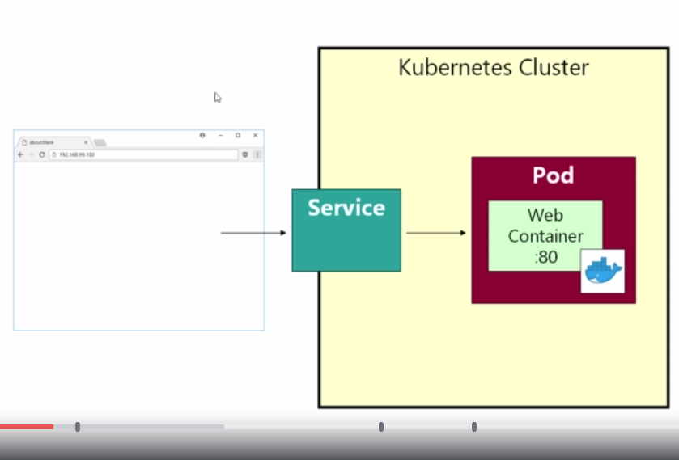
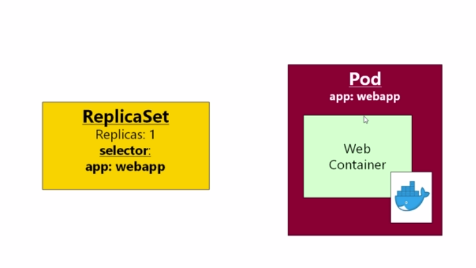
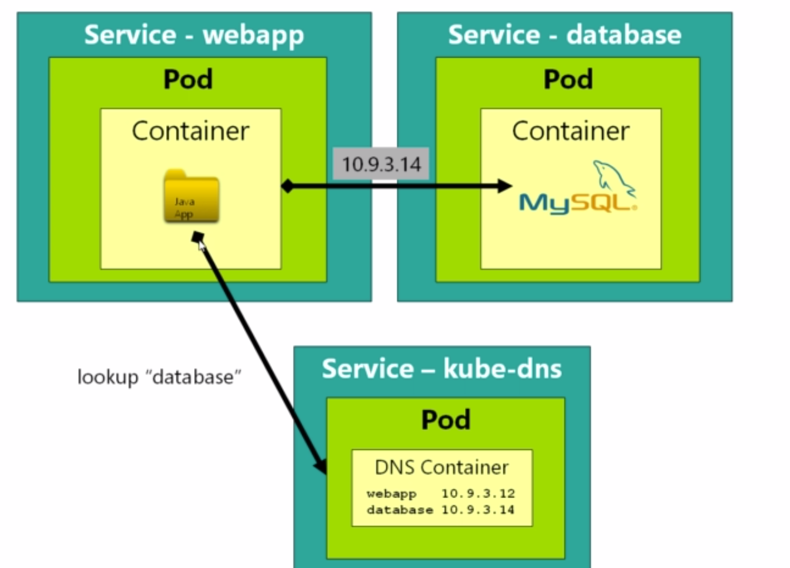
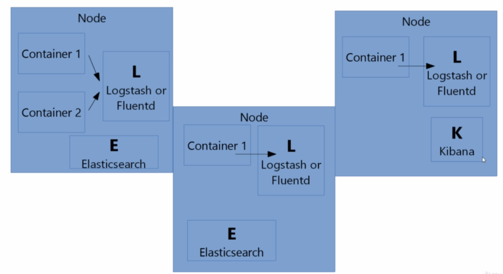

# Complete installation and setup 
  Guide provided under fullstack - gitlab, under kubernetes folder
  
### To create a pod

```
apiVersion: v1
kind: Pod
metadata:
  name: myapp-pod
  labels:
    app: myapp
spec:
  containers:
  - name: myapp-container
    image: richardchesterwood/k8s-fleetman-webapp-angular:release0
```

### To run the above pod

```
kubectl apply -f pod.yaml
```

### To delete a pod

```
command: kubectl delete pod <pod-name>
Ex: kubectl delete pod myapp-pod  # To find out the name of the pod use the command ```kebectl get all```
```

### To check for the log file of the pods

Note: you will get logs for only pods. You will not get logs for replicasets or deployments

```
kubectl logs <pod-name>
```

### To delete pods, replicasets and every other resources

```
kubectl delete -f .
```

### To execute a command in the container of the above pod

```
command: kubectl exec <name-of-pod> <command to be executed>
kubectl exec myapp-pod ls

```

### To get a shell to the above pod

```
kubectl -it exec myapp-pod sh
```

---

# Attaching services to pods

Be default pods are not exposed to real world. To expose a pod it should be attached to a service. 



### Writing a service for the above pod created

```
apiVersion: v1
kind: Service
metadata:
  name: my-service
spec:
  selector:
    app: myapp  # Here myapp is the label provided to pod 

  ports:
    - name: http
      port: 80
      nodePort: 30080

  type: NodePort
```

### To execute the above service created

```
kubectl apply -f services.yaml

```

Finally you can access the application using

Ip address would be of any node in the kubernetes cluster

http://xx.xxx.xxx.xxx:30080

---

# ReplicaSets

Pods may die and if pods die it will not be recreated. If pods are to be automatically recreated then pods have to defined as ReplicaSets. In replicaset we mention how many instances of this pod do we want kubernetes to run at any given time. So if we set the replicaset as "3", three instances of pod will be created and if one pod dies kubernetes tries to make sure to create another one pod to equal the amount of "3" replicaset

### Converting the above pod to replica set

```
apiVersion: apps/v1
kind: ReplicaSet
metadata:
 name: webapp
spec:
 # In selector block we mention which pod should be a part of the replica set. 
 selector:
   matchLabels:
     app: myapp # myapp is the name of the pod which will be a part of this replica set
 replicas: 2

 # From here you mention the complete pod definition
 template:
   metadata:
     labels:
       app: myapp # This label is used in the service section 
   spec:
     containers:
     - name: myapp-container
       image: richardchesterwood/k8s-fleetman-webapp-angular:release0
```

### A pictorial diagram of the replicaSet



### To delete a ReplicaSet in kubernetes

```
command: kubectl delete rs <replica-set-name>
syntax: kubectl delete rs webapp   
```

Note: To get the name of the ReplicaSet use ```kubectl get all```

# Deployment - converting ReplicaSets to Deployment

If you are using deployments you can rollback your microservices using command line. Rollback will rollback your microservice to a previous state without any delay i.e the customers will not face any down-time. What it does is runs the current replicaset and creates another replicaset for rollbacked version. Only when the rollbacked version starts running the current version is then stalled.

```
apiVersion: apps/v1
kind: Deployment
metadata:
 name: webapp
spec:
 # In selector block we mention which pod should be a part of the replica set. 
 selector:
   matchLabels:
     app: myapp # myapp is the name of the pod which will be a part of this replica set
 replicas: 2

 # From here you mention the complete pod definition
 template:
   metadata:
     labels:
       app: myapp # This label is used in the service section 
   spec:
     containers:
     - name: myapp-container
       image: richardchesterwood/k8s-fleetman-webapp-angular:release0
```

### To run the above deployment. A deployment will create a replicaset and a pod

```
kubectl apply -f pods.yaml
```

### To rollback to the previous deployment

```
syntax: kubectl rollout status deployment <name-of-the-deployment>
command: kubectl rollout status deployment webapp
```

### To undo the rollout

```
kubectl rollout undo deploy webapp #Here webapp is the name of the deployment
```

### To find various revisions where you can rollout

```
kubectl rollout history deploy webapp #Here webapp is the name of the deployment
```

# Namespaces in kubernetes

If you want to segregate your microservice you can do that using namespaces i.e a seperate namespace for ordering pods, a seperate namespace for payment related pods etc. If you do not mention any namespaces all pods will be allocated to default namespaces

### To list all the namespaces

```
kubectl get namespaces
```

### To list all pods in a particular namespace

```
Syntax: kubectl get pods -n <namespace name>
Command: kubectl get pods -n kube-system
         kubectl get all -n kube-system # Lists all pods, replicasets, deployments in namespaces
```

# Exercise 1:

Now let us create a cluster like this.

This cluster has two pods. One is a pod with a small program and another pod contains mysql. The pod with the program connects to the mysql pod. In kubernetes each pod is assigned an ip address. Every time you create a pod, the corresponding pod's IP address is recorded in kube-dns. kubde-dns is like a DNS entry record for kubernetes cluster



# 1. Mysql POD and Service

```
apiVersion: v1
kind: Pod
metadata:
  name: mysql
  labels:
    app: mysql
spec:
  containers:
   - name: mysql
     image: mysql:5     #docker image
     env:
      # Use secret in real life
      - name: MYSQL_ROOT_PASSWORD
        value: password
      - name: MYSQL_DATABASE
        value: fleetman   #fleetman is the name of the database created
---
kind: Service
apiVersion: v1
metadata:
  name: database
spec:
  selector:
    app: mysql
  ports:
  - port: 3306
  type: ClusterIP #ClusterIP means this pod is provided an interntal IP and the pod can only be accessed within the cluster
```


# 2. Writing the application microservice

```
apiVersion: v1
kind: Pod
metadata:
  name: myapp-pod
  labels:
    app: myapp
spec:
  containers:
  - name: myapp-container
    image: richardchesterwood/k8s-fleetman-webapp-angular:release0    
---
apiVersion: v1
kind: Service
metadata:
  name: my-service
spec:
  selector:
    app: myapp  # Here myapp is the label provided to pod 

  ports:
    - name: http
      port: 80
      nodePort: 30080

  type: NodePort
  
```

Loggging into the myapp alpine container pod 

```
syntax: kubectl exec -it webapp-6785db948f-k29nn sh
command: kubectl exec -it <pod name> sh
```

# 3. Accessing mysql server from myapp pod

To access the mysql server from another pod we will have to install mysql client in the myapp pod.

To install the mysql client in the myapp pod, log into the alpine pod and install mysql client like show below

1. Log into the pod 

```
syntax: kubectl exec -it webapp-6785db948f-k29nn sh
command: kubectl exec -it <pod name> sh
```

2. Install mysql client in the myapp pod and connect to the mysql server

```
apk update
apk add mysql-client
mysql -h database -uroot -ppassword fleetman # Please check the mysql-pod.yaml where database details are provided
```

# Logging a Kubernetes cluster

To log a kubernetes cluster we need to install ELK stack

Suppose we have a 2 node cluster we will have to install elastic search and logstash in each node. It is enough that we install kibana in any one node since only a single user would be using kibana and since it need not be scaled. This is the architecture that we should follow to log a kubernetes cluster.



---

# Checking for container liviness probe 

The below snippet checks whether container or pod is running or not. This is written inside a pod or deployment or replicaset
It waits 15 to do the first check and times out after 30 seconds. It keeps on checking whether the pod is running or not. If it is not running the pod is terminated and kubernetes tries to recreate it. If you do not mention the pod might be down and traffic might be routed to the pod. This should always be included if you are deploying application in production.

```
 livenessProbe:
         httpGet:
           path: /
           port: 3000 or the port name
         initialDelaySeconds: 15
         timeoutSeconds: 30
```

# Checking for container rediness probe

The readiness probe ensures that the pod will only recieve traffic when the readiness probe is success. The readiness probe checks whether the container is ready to serve requests. This also has to be configured in a production environment. If the readinessProbe fails then the IP address of the pod will also be removed and no traffic will reach this pod until the readiness probe gives a success again.

```
readinessProbe:
         httpGet:
           path: /
           port: 3000
         initialDelaySeconds: 15
         timeoutSeconds: 30
```
